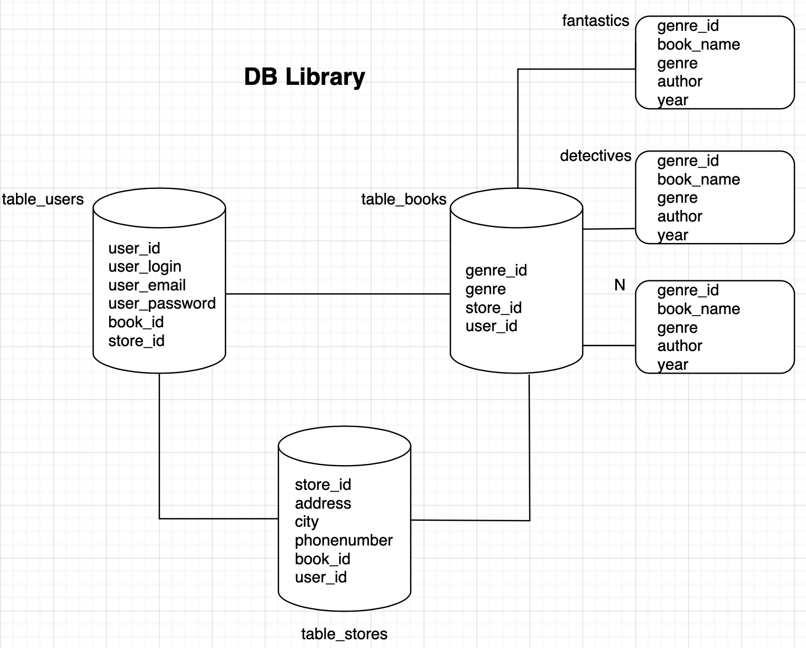

# Домашнее задание к занятию «Репликация и масштабирование. Часть 2»

---

### Задание 1

Опишите основные преимущества использования масштабирования методами:

- активный master-сервер и пассивный репликационный slave-сервер; 
- master-сервер и несколько slave-серверов;
- активный сервер со специальным механизмом репликации — distributed replicated block device (DRBD);
- SAN-кластер.

*Дайте ответ в свободной форме.*

#### Ответ на задание 1.
1. Активный master, пассивный slave.
При данной схеме взаимодействия мы получаем определенную избыточность данных в виде сервера реплики с ролью SLAVE. При выходе из строя основного сервера, мы не потеряем данные полностью и сможем воспользоваться сервером SLAVE.
Также при данной схеме помимо избыточности мы имеем распределенность вычислений. Когда на MASTER сервере данные пишутся, удаляются, изменяются, на SLAVE, в свою очередь данные читаются.

2. 1 MASTER, N SLAVE.
Данная схема применяется в случае, когда мы имеем достаточно большую базу данных и хотим распределить нагрузку.
По своей сути схема повторяет схему из пункта 1, только может применяться например в геораспределенной инфраструктуре.

3. DRBD.
Специальный модуль ядра Linux, позволяющий для вашего локального блочного устройства сделать зеркалирование на удаленном по сети сервере. Обычно применяется в НА решениях.
При полной синхронизации между DRBD устройствами позволяет повысить устойчивость вашей СУБД.

4. SAN-кластер.
Система хранения данных, предоставляемая для вашей СУБД по сети. Система обладает всеми инструментами, необходимыми для обеспечения отказоуйсточивости и повышения надежности.
Также, при использовании ее для схемы master-n slave, позволяет добиться повышенной производительности при работе с базой данных.

---

### Задание 2

Разработайте план для выполнения горизонтального и вертикального шаринга базы данных. База данных состоит из трёх таблиц: 

- пользователи, 
- книги, 
- магазины (столбцы произвольно). 

Опишите принципы построения системы и их разграничение или разбивку между базами данных.

*Пришлите блоксхему, где и что будет располагаться. Опишите, в каких режимах будут работать сервера.* 

#### Ответ на задание 2.

На данной схеме представлены два варианта шардирования:
1. Вертикальное.
База данных библиотеки представляла собой базу с тремя таблицами, которые я разнес на выделенные сервера, организовав между ними связи по ключевым полям. "На всякий случай".
2. Горизонтальное.
Я решил, что будет неплохой мыслью разбить одну большую таблицу по книгам на количество таблиц, соответствующих количеству жанров.

---

## Дополнительные задания (со звёздочкой*)
Эти задания дополнительные, то есть не обязательные к выполнению, и никак не повлияют на получение вами зачёта по этому домашнему заданию. Вы можете их выполнить, если хотите глубже шире разобраться в материале.

---
### Задание 3*

Выполните настройку выбранных методов шардинга из задания 2.

*Пришлите конфиг Docker и SQL скрипт с командами для базы данных*.
